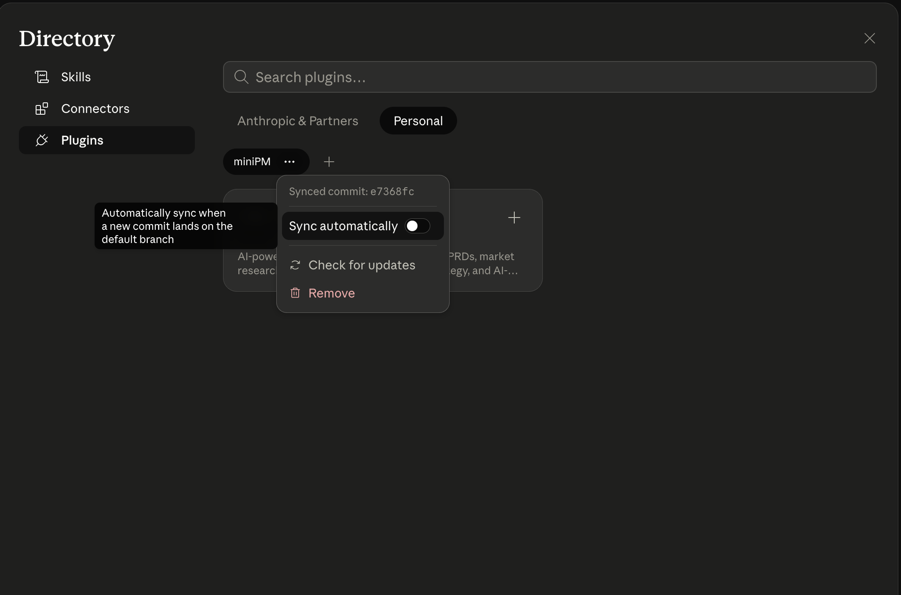

# MiniPM — Your Personal AI PM Toolkit

**Build your own AI-powered product management toolkit inside Claude.**


MiniPM is a Claude plugin for product managers. Install it once, use any skill with a single slash command, and add more skills as your workflow grows. It's not a fixed tool — it's a toolkit you own.

---

## Overview

**MiniPM** packages senior PM best practices into repeatable, AI-powered skills you invoke directly inside Claude. Instead of prompting from scratch every time, each skill brings structure, rigor, and research to your output automatically.

Each skill asks Claude to think and respond like a senior PM. You bring the context; MiniPM brings the framework.

**Who it's for:** PMs at any level who want faster, higher-quality output without starting from a blank page — and anyone breaking into product or AI product roles who wants professional-grade frameworks on demand.

> More skills are added regularly. Install once and sync to stay current.

---

## What's inside

| Skill | Category | What it produces |
|---|---|---|
| `/prd` | Strategy | Full PRD — hypothesis, problem, solution, metrics, rollout plan |
| `/prd-review` | Strategy | PRD quality audit — completeness checklist for 2-pagers and 6-pagers |
| `/project-eval` | Strategy | Weighted project evaluation — score, strengths, gaps, and research-backed suggestions |
| `/market-research` | Research | Competitive landscape, TAM/SAM/SOM, trends, pricing intel, strategic implications |
| `/user-research` | Research | Synthesizes raw interviews and notes into ranked PM insights |
| `/job-strategy` | Career | Personalized AI job strategy — diagnosis, positioning, outreach, prep |
| `/resume-builder` | Career | AI-optimized resume — impact bullets, ATS keywords, tailored to the role |
| `/substack-writer` | Content | Publication-ready Substack article — real-time research, topic selection, style-matched writing, PDF export |

---

## Install

1. Open Claude app
2. Click **Customize** in the sidebar


3. Under **Personal Plugins**, click **Add** → **Create Plugin** → **Add Marketplace**


4. Paste the repo URL:
   ```
   https://github.com/initmahesh/miniPM.git
   ```


5. A **Directory** option will appear — under **Personal**, you will see the **miniPM** plugin listed


6. Click the **Sync** icon next to the plugin to enable automatic updates — this ensures new skills added to the repo appear in Claude without reinstalling



7. Click on the plugin and then click **Install**


8. You now have the plugin with all the skills available inside Claude


---

## Usage

Once installed, invoke any skill by name:

```
/prd  Real-time collaboration feature for enterprise design teams
```
```
/prd-review  [paste your PRD]
```
```
/project-eval  [paste your product idea, persona, MOAT, and why agentic AI]
```
```
/market-research  AI coding assistants for enterprise software teams
```
```
/user-research  [paste interview transcripts or research notes]
```
```
/job-strategy  I want to land an AI PM role at a top foundation model company
```
```
/resume-builder  [paste your current resume]
```
```
/substack-writer  AI agents are replacing junior PMs — write a Substack article on this
```

Every skill accepts free-text input and returns structured, senior-quality output.

---

## Repo Structure

```
miniPM/
├── .claude-plugin/
│   ├── plugin.json          ← plugin manifest
│   └── marketplace.json     ← marketplace index
├── skills/
│   ├── prd/SKILL.md
│   ├── prd-review/SKILL.md
│   ├── project-eval/SKILL.md
│   ├── market-research/SKILL.md
│   ├── user-research/SKILL.md
│   ├── job-strategy/SKILL.md
│   ├── resume-builder/SKILL.md
│   └── substack-writer/SKILL.md
├── assets/
└── README.md
```

---

## License

MIT — free to use, fork, and extend.
