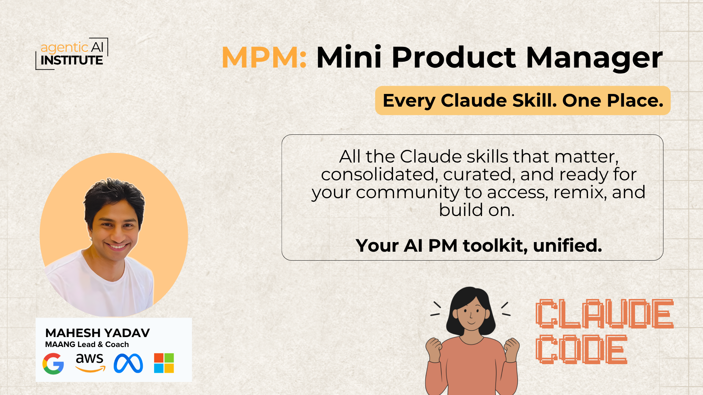

# Mini PM

**AI-powered skills for product managers, built as a Claude plugin.**



Stop writing the same PRDs, research briefs, and job strategies from scratch. Mini PM gives you a focused PM toolkit inside Claude — strategy, research, and career, all invokable in one line.

---

## What's inside

| Skill | Category | What it produces |
|---|---|---|
| `/prd` | Strategy | Full PRD — hypothesis, problem, solution, metrics, rollout plan |
| `/prd-review` | Strategy | PRD quality audit — completeness checklist for 2-pagers and 6-pagers |
| `/market-research` | Research | Competitive landscape, TAM/SAM/SOM, trends, pricing intel, strategic implications |
| `/user-research` | Research | Synthesizes raw interviews and notes into ranked PM insights |
| `/job-strategy` | Career | Personalized AI job strategy — diagnosis, positioning, outreach, prep |
| `/resume-builder` | Career | AI-optimized resume — impact bullets, ATS keywords, tailored to the role |

---

## Install

### Via Claude plugin marketplace
Search **Mini PM** in the Claude plugin marketplace and click Install.

### Manual install (Claude Code CLI)
```bash
git clone https://github.com/sachin0034-tech/mini-pm.git
cp -r mini-pm/skills/ ~/.claude/commands/
```

---

## Usage

Once installed, invoke any skill by name:

```
/prd  Real-time collaboration feature for enterprise design teams
```
```
/market-research  AI coding assistants for enterprise software teams
```
```
/prd-review  [paste your PRD]
```
```
/user-research  [paste interview transcripts or research notes]
```
```
/job-strategy  I want to land an AI PM role at a top foundation model company
```
```
/resume-builder  [paste your current resume]
```

Every skill accepts free-text input and returns structured, senior-quality output.

---

## Repo structure

```
mini-pm/
├── .claude-plugin/
│   ├── plugin.json          ← plugin manifest
│   └── marketplace.json     ← marketplace index
├── skills/
│   ├── prd/SKILL.md
│   ├── prd-review/SKILL.md
│   ├── market-research/SKILL.md
│   ├── user-research/SKILL.md
│   ├── job-strategy/SKILL.md
│   └── resume-builder/SKILL.md
├── assets/banner.png
└── README.md
```

---

## License

MIT — free to use, fork, and extend.
